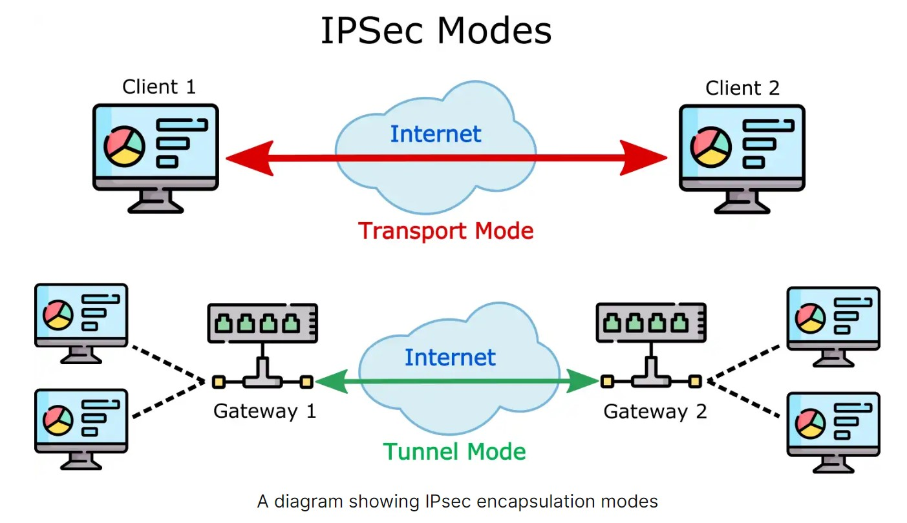

# Information Security Manual 2022 Notes
This is a write up of all my notes I've taken from reading Information Security Manual document. It was a pleasure to read as I'm an aspiring cyber security professional at time the of creating this. I've taken all the tips and tricks I learnt from my readings and applied it to my everyday life and I cannot wait to learn more from here on. I would highly recommend anyone has an interest in security to read the 185 paged document, as it blew my mind a couple of times. I hope anyone who reads my write up takes something away from it, as a community, knowledge is power and I've done my job of sharing my wisdom. 

sources: https://www.cyber.gov.au/acsc/view-all-content/ismx         https://www.cyber.gov.au/acsc/view-all-content/essential-eight

 

- [Information Security Manual 2022 Notes](#information-security-manual-2022-notes)
- [Becoming a CISO](#becoming-a-ciso)
  - [**Required Skills and Experience**](#required-skills-and-experience)
  - [**Providing Cyber Security Leadership and Guidance**](#providing-cyber-security-leadership-and-guidance)
  - [**Overseeing The Cyber Security Program**](#overseeing-the-cyber-security-program)
  - [**Coordinating Cyber Security**](#coordinating-cyber-security)
  - [**Communication**](#communication)
  - [**Business Continuity and Disaster Recovery Planning**](#business-continuity-and-disaster-recovery-planning)
  - [**Working with Suppliers**](#working-with-suppliers)
  - [**Budgeting**](#budgeting)
  - [**Overseeing Cyber Security personnel**](#overseeing-cyber-security-personnel)
  - [Risk Assesment](#risk-assesment)
  - [Protecting Systems and Their Resources](#protecting-systems-and-their-resources)
  - [Cyber Security Events](#cyber-security-events)
  - [Cyber Security Incidents](#cyber-security-incidents)
  - [Cyber Secuity Resilience](#cyber-secuity-resilience)
  - [Dectecting Cyber Security Incidents](#dectecting-cyber-security-incidents)
  - [Incident Management Policy](#incident-management-policy)
  - [Cyber Security Incident Register](#cyber-security-incident-register)
    - [Security incident registry is maintained by covering the following:](#security-incident-registry-is-maintained-by-covering-the-following)
  - [Trusted Insider Program](#trusted-insider-program)
  - [Handling and Containing Data Spills](#handling-and-containing-data-spills)
  - [Handling and Containing Malicious Code Infections](#handling-and-containing-malicious-code-infections)
  - [Reporting Cyber Security Incidents](#reporting-cyber-security-incidents)
  - [Reporting Cyber Security Incidents to the ACSC](#reporting-cyber-security-incidents-to-the-acsc)
  - [Cyber Supply Chain Risk Management Activities](#cyber-supply-chain-risk-management-activities)
  - [Purchasing of Applications, ICT Equipment and Services](#purchasing-of-applications-ict-equipment-and-services)
  - [Contractual Security Requirements](#contractual-security-requirements)
  - [Cyber Security Strategy](#cyber-security-strategy)
  - [Maintenance of Security Documentation](#maintenance-of-security-documentation)
    - [*Security documentation is reviewed at least annually and includes a ‘current as at \[date\]’ or equivalent statement.*](#security-documentation-is-reviewed-at-least-annually-and-includes-a-current-as-at-date-or-equivalent-statement)
- 
  - [Communication of Security Documentation](#communication-of-security-documentation)
  - [Reporting Cryptographic-Related Cyber Security Incidents](#reporting-cryptographic-related-cyber-security-incidents)
  - [Monitoring Plan](#monitoring-plan)
- [Guidelines for Physical Security](#guidelines-for-physical-security)
  - [Physical Access to Systems](#physical-access-to-systems)
  - [Physical Access to Servers, Network Devices and Cryptographic Equipment](#physical-access-to-servers-network-devices-and-cryptographic-equipment)
  - [Physical Access to Network Devices in Public Areas](#physical-access-to-network-devices-in-public-areas)
  - [Bringing Radio Frequency and Infrared Devices into Facilities](#bringing-radio-frequency-and-infrared-devices-into-facilities)
- [Guidelines for Personnel Security](#guidelines-for-personnel-security)
  - [Preventing Observation by Unauthorised People](#preventing-observation-by-unauthorised-people)
  - [Providing Cyber Security Awareness Training](#providing-cyber-security-awareness-training)
  - [Reporting Suspicious Contact via Online Services](#reporting-suspicious-contact-via-online-services)
  - [Sending and Receiving Files via Online Services](#sending-and-receiving-files-via-online-services)
- [Access to Systems and their Resources](#access-to-systems-and-their-resources)
  - [System Access Requirements](#system-access-requirements)
  - [Privileged Access to Systems](#privileged-access-to-systems)
  - [Recording Authorisation for Personnel to Access Systems](#recording-authorisation-for-personnel-to-access-systems)
    - [**a secure record is maintained for the life of each system covering:**](#a-secure-record-is-maintained-for-the-life-of-each-system-covering)
  - [Temporary Access to Systems](#temporary-access-to-systems)
  - [Emergency Access to Systems](#emergency-access-to-systems)
- [Cabling Infrastructure](#cabling-infrastructure)
  - [Labelling Cables](#labelling-cables)
  - [Labelling Building Management Cables](#labelling-building-management-cables)
  - [Labelling Cables for Foreign Systems in Australian Facilities](#labelling-cables-for-foreign-systems-in-australian-facilities)
  - [Cable Colours](#cable-colours)
  - [Cable Colour Non-Conformance](#cable-colour-non-conformance)
  - [Cable Inspectability](#cable-inspectability)
  - [Common cable reticulation systems and conduits](#common-cable-reticulation-systems-and-conduits)
  - [Covers for Enclosed Cable Reticulation Systems](#covers-for-enclosed-cable-reticulation-systems)
  - [Sealing cable reticulation systems and conduits](#sealing-cable-reticulation-systems-and-conduits)
  - [Labelling conduits](#labelling-conduits)
  - [Wall penetrations](#wall-penetrations)
  - [Wall Outlet Box Colours](#wall-outlet-box-colours)
  - [Wall Outlet Box Covers](#wall-outlet-box-covers)
  - [Physical Separation of Cabinets and Patch Panels](#physical-separation-of-cabinets-and-patch-panels)
  - [Audio Secure Rooms](#audio-secure-rooms)
  - [Power Reticulation](#power-reticulation)
- [Emanation Security](#emanation-security)
  - [Emanation security threat assessments in Australia](#emanation-security-threat-assessments-in-australia)
  - [Early Consideration of Emanation Security Threats](#early-consideration-of-emanation-security-threats)
- [Telephone Systems](#telephone-systems)
  - [Telephone System Usage Policy](#telephone-system-usage-policy)
  - [Off-Hook Audio Protection](#off-hook-audio-protection)
  - [Cordless Telephone Systems](#cordless-telephone-systems)
- [Video Conferencing and Internet Protocol Telephony](#video-conferencing-and-internet-protocol-telephony)
  - [Video Conferencing and Internet Protocol Telephony Infrastructure Hardening](#video-conferencing-and-internet-protocol-telephony-infrastructure-hardening)
  - [Video Conferencing Unit and Internet Protocol Phone Authentication](#video-conferencing-unit-and-internet-protocol-phone-authentication)
- [Mobile Device Management](#mobile-device-management)
  - [ASD-Approved Platforms](#asd-approved-platforms)
  - [Paging, Message Services and Messaging Apps](#paging-message-services-and-messaging-apps)
  - [Using Mobile Devices in Public Spaces](#using-mobile-devices-in-public-spaces)
  - [Mobile Device Emergency Sanitisation Processes and Procedures](#mobile-device-emergency-sanitisation-processes-and-procedures)
  - [Before Travelling Overseas with Mobile Devices](#before-travelling-overseas-with-mobile-devices)
    - [**Before travelling overseas with mobile devices, personnel take the following actions:**](#before-travelling-overseas-with-mobile-devices-personnel-take-the-following-actions)
  - [While Travelling Overseas with Mobile Devices](#while-travelling-overseas-with-mobile-devices)
    - [Personnel take the following precautions when travelling overseas with mobile devices:](#personnel-take-the-following-precautions-when-travelling-overseas-with-mobile-devices)
  - [After Travelling Overseas with Mobile Devices](#after-travelling-overseas-with-mobile-devices)
    - [If returning from travelling overseas with mobile devices to high or extreme risk countries, personnel take the following additional actions:](#if-returning-from-travelling-overseas-with-mobile-devices-to-high-or-extreme-risk-countries-personnel-take-the-following-additional-actions)
- [Evaluated Products](#evaluated-products)
  - [Evaluated Configuration](#evaluated-configuration)
  - [Use of High Assurance ICT Equipment in Unevaluated Configurations](#use-of-high-assurance-ict-equipment-in-unevaluated-configurations)
- [ICT Equipment Usage](#ict-equipment-usage)
  - [ICT Equipment Register](#ict-equipment-register)
  - [Labelling ICT Equipment](#labelling-ict-equipment)
  - [Labelling High Assurance ICT Equipment](#labelling-high-assurance-ict-equipment)
  - [Classifying ICT Equipment](#classifying-ict-equipment)
- [ICT Equipment Sanitisation and Destruction](#ict-equipment-sanitisation-and-destruction)
  - [Treatment of Non-Volatile Magnetic Media Following Sanitisation](#treatment-of-non-volatile-magnetic-media-following-sanitisation)
  - [Treatment of Non-Volatile Flash Memory Media Following Sanitisation](#treatment-of-non-volatile-flash-memory-media-following-sanitisation)
  - [Media that Cannot be Successfully Sanitised](#media-that-cannot-be-successfully-sanitised)
- [Application Control](#application-control)
  - [Standard Operating Environments](#standard-operating-environments)
  - [Hardening Operating System Configurations](#hardening-operating-system-configurations)
  - [Application Management](#application-management)
  - [NET Framework is used to create and run software applications](#net-framework-is-used-to-create-and-run-software-applications)
  - [Backup of Logs](#backup-of-logs)
  - [Patching](#patching)
  - [Application Control](#application-control-1)
  - [PowerShell](#powershell)
  - [Host-based Intrusion Prevention System](#host-based-intrusion-prevention-system)
  - [Anti Virus](#anti-virus)
    - [**Antivirus software is implemented on workstations and servers with:**](#antivirus-software-is-implemented-on-workstations-and-servers-with)
  - [Device Access Control Software](#device-access-control-software)
  - [Operating System Event Logging](#operating-system-event-logging)
  - [Hardening Application Configurations](#hardening-application-configurations)
- [User Accounts](#user-accounts)
  - [Multi Factor Authentication](#multi-factor-authentication)
  - [Single Factor Authentication](#single-factor-authentication)
  - [Setting credentials for user accounts](#setting-credentials-for-user-accounts)
  - [Account Lockouts](#account-lockouts)
  - [Insecure Authentication](#insecure-authentication)
  - [Protecting Credentials](#protecting-credentials)
  - [Cached Credentials](#cached-credentials)
  - [Session Termination](#session-termination)
  - [Session and Screen Locking](#session-and-screen-locking)
  - [Logon Banner](#logon-banner)
  - [Separate Privileged Operating Environments](#separate-privileged-operating-environments)
  - [Administrative Infrastructure](#administrative-infrastructure)
- [New Updates](#new-updates)
  - [Software Register](#software-register)
  - [When to patch security vulnerabilities](#when-to-patch-security-vulnerabilities)
  - [Scanning for missing patches or updates](#scanning-for-missing-patches-or-updates)
  - [Event Log Retention](#event-log-retention)
  - [Backup Access and Modification](#backup-access-and-modification)
  - [Development, Testing and Production Environments](#development-testing-and-production-environments)
  - [Software Bill of Materials](#software-bill-of-materials)
  - [Vulnerability Disclosure Program](#vulnerability-disclosure-program)
- [Database Management System Software](#database-management-system-software)
  - [Network Environment](#network-environment)
  - [Temporary Installation Files and Logs](#temporary-installation-files-and-logs)
  - [Hardening and Configuration](#hardening-and-configuration)
  - [Restricting Privileges](#restricting-privileges)
  - [Database Administrator Accounts](#database-administrator-accounts)
  - [Separation of Development, Testing and Production Databases](#separation-of-development-testing-and-production-databases)
  - [Protecting Database Contents](#protecting-database-contents)
- [Networking Protocols and Configurations](#networking-protocols-and-configurations)
  - [DomainKeys Identified Mail](#domainkeys-identified-mail)
  - [Using Internet Protocol Version 6](#using-internet-protocol-version-6)
  - [Network Access Controls](#network-access-controls)
  - [Functional Separation Between Servers](#functional-separation-between-servers)
  - [Use of Simple Network Management Protocol](#use-of-simple-network-management-protocol)
  - [Using Network-based Intrusion Detection and Prevention Systems](#using-network-based-intrusion-detection-and-prevention-systems)
  - [Blocking Anonymity Network Traffic](#blocking-anonymity-network-traffic)
  - [Protective Domain Name System Services](#protective-domain-name-system-services)
  - [Default Accounts for Network Devices](#default-accounts-for-network-devices)
  - [Regularly Restarting Network Devices](#regularly-restarting-network-devices)
  - [Choosing Wireless Devices](#choosing-wireless-devices)
  - [Public Wireless Networks](#public-wireless-networks)
  - [Administrative Interfaces for Wireless Access Points](#administrative-interfaces-for-wireless-access-points)
  - [Default Settings](#default-settings)
  - [Media Access Control address filtering](#media-access-control-address-filtering)
  - [Static Addressing](#static-addressing)
- [Cryptography](#cryptography)
  - [Confidentiality and Integrity of Wireless Network Traffic](#confidentiality-and-integrity-of-wireless-network-traffic)
  - [802.1X Authentication](#8021x-authentication)
  - [ **KEY TAKEAWAYS**](#-key-takeaways)
  - [Evaluation of 802.1X authentication implementation](#evaluation-of-8021x-authentication-implementation)
  - [Remote Authentication Dial-In User Service Authentication](#remote-authentication-dial-in-user-service-authentication)
  - [Protecting Management Frames on Wireless Networks](#protecting-management-frames-on-wireless-networks)
  - [Wireless Network Footprint](#wireless-network-footprint)
- [Service Continuity for Online Services](#service-continuity-for-online-services)
  - [Denial of Service Strategies](#denial-of-service-strategies)
  - [Domain Name Registrar Locking](#domain-name-registrar-locking)
  - [Monitoring with Real-Time Alerting for Online Services](#monitoring-with-real-time-alerting-for-online-services)
  - [Preparing for Service Continuity](#preparing-for-service-continuity)
  - [Mode of Operation](#mode-of-operation)
  - [Protocol Selection](#protocol-selection)
  - [Security Association Lifetimes](#security-association-lifetimes)
  - [Perfect Forward Secrecy](#perfect-forward-secrecy)
      - [source: https://www.techtarget.com/whatis/definition/perfect-forward-secrecy#:~:text=With%20perfect%20forward%20secrecy%2C%20every,would%20stay%20encrypted%20and%20secure.](#source-httpswwwtechtargetcomwhatisdefinitionperfect-forward-secrecytextwith20perfect20forward20secrecy2c20everywould20stay20encrypted20and20secure)
  - [Border Gateway Protocol Route Security](#border-gateway-protocol-route-security)
- [Cross Domain Solutions](#cross-domain-solutions)
  - [Introduction to Cross Domain Solutions](#introduction-to-cross-domain-solutions)
  - [Types of Cross Domain Solutions](#types-of-cross-domain-solutions)
  - [Implementing Cross Domain Solutions](#implementing-cross-domain-solutions)
  - [Consultation on Cross Domain Solutions](#consultation-on-cross-domain-solutions)
  - [Separation of data flows](#separation-of-data-flows)
  - [User Training](#user-training)
- [Using Diodes](#using-diodes)
  - [Using Diodes](#using-diodes-1)
- [Security Filters](#security-filters)
  - [Using Web Content Filters](#using-web-content-filters)
  - [Transport Layer Security Filtering](#transport-layer-security-filtering)
  - [Allowing and blocking access to domain names](#allowing-and-blocking-access-to-domain-names)
  - [Content filtering techniques](#content-filtering-techniques)
  - [Encrypted Files](#encrypted-files)
  - [Archive Files](#archive-files)
  - [Automated Dynamic Analysis](#automated-dynamic-analysis)
  - [Allowing Specific Content Types](#allowing-specific-content-types)
  - [Content Validation](#content-validation)
  - [Content Conversion](#content-conversion)
  - [Content Sanitisation](#content-sanitisation)
  - [Validating File Integrity](#validating-file-integrity)

# Becoming a CISO

## **Required Skills and Experience**
 
The role of the Chief Information Security Officer (CISO) requires a combination of technical and soft skills, such as business acumen, leadership, communications and relationship building. Additionally, a CISO must adopt a continuous approach to learning and up-skilling in order to maintain pace with the cyber threat landscape and new technologies. It is expected that a CISO show innovation and imagination in conceiving and delivering cyber security strategies for their organisation.

## **Providing Cyber Security Leadership and Guidance** 
To provide cyber security leadership and guidance within an organisation, it is important that the organisation appoints a CISO.

## **Overseeing The Cyber Security Program**
The CISO is also responsible for overseeing their organisation’s response to cyber security incidents, including how internal teams respond and communicate with each other during an incident. In the event of a major cyber security incident, the CISO should be prepared to step into a crisis management role. They should understand how to bring clarity to the situation and communicate effectively with internal and external stakeholders.

## **Coordinating Cyber Security**
The CISO is responsible for ensuring the alignment of cyber security and business objectives within their organisation. To achieve this, they should facilitate communication between cyber security and business stakeholders. This includes translating cyber security concepts and language into business concepts and language, as well as ensuring that business teams consult with cyber security teams to determine appropriate controls when planning new business projects. Additionally, as the CISO is responsible for the development of their organisation’s cyber security program, they are best placed to advise projects on the strategic direction of cyber security within their organisation.

## **Communication**
The CISO is responsible for reporting cyber security matters to their organisation’s senior executive or Board. Reporting should cover:
- The organisation’s security risk profile
- The status of key systems and any outstanding security risks
- Any planned cyber security uplift activities
- Any recent cyber security incidents
- Expected returns on cyber security investments.
  
Reporting on cyber security matters should be structured by business functions, regions or legal entities and support a consolidated view of an organisation’s security risks. It is important that the CISO is able to translate security risks into operational risks for their organisation, including financial and legal risks, in order to enable more holistic conversations about their organisation’s risks.

## **Business Continuity and Disaster Recovery Planning**
The CISO is responsible for contributing to the development and maintenance of their organisation’s business continuity and disaster recovery plans, with the aim to improve business resilience and ensure the continued operation of critical business processes.

## **Working with Suppliers**

The CISO is responsible for ensuring that consistent vendor management processes are applied across their organisation, from discovery through to ongoing management. As supplier relationships come with additional security risks, the CISO should assist personnel with assessing cyber supply chain risks and understand the security impacts of entering into contracts with suppliers.

## **Budgeting**
Receiving and managing a dedicated cyber security budget will ensure the CISO has sufficient access to funding to support their cyber security program, including cyber security uplift activities and responding to cyber security incidents.

## **Overseeing Cyber Security personnel**
The CISO is responsible for the cyber security workforce within their organisation, including plans to attract, train and retain cyber security personnel. The CISO should also delegate relevant tasks to cyber security managers and other personnel as required and provide them with adequate authority and resources to perform their duties.

 

## Risk Assesment
Following the implementation or modification of any controls as a result of risk management activities, another security assessment should be completed. In doing so, the system’s authorisation package should be updated. This in turn allows the authorising officer to make an informed risk-based decision as to whether the security risks associated with the system’s operation are still acceptable. Should security risks no longer be acceptable, the authorising officer may choose to either place constraints on the system’s use, such as introducing or amending an expiration date for authorisation to operate, or revoke authorisation to operate altogether.

## Protecting Systems and Their Resources
Broadly, the risk management framework used by the Information Security Manual has six steps:

- System owners determine the type, value and security objectives for each system based on an assessment of the impact if it were to be compromised.
- System owners select controls for each system and tailor them to achieve desired security objectives.
- System owners implement controls for each system and its operating environment.
- System owners ensure controls for each system and its operating environment are assessed to determine if they have been implemented correctly and are operating as intended.
- System owners obtain authorisation to operate each system from its authorising officer based on the acceptance of the security risks associated with its operation.
- System owners monitor each system, and associated cyber threats, security risks and controls, on an ongoing basis.

 

## Cyber Security Events
A cyber security event is an occurrence of a system, service or network state indicating a possible breach of security policy, failure of safeguards or a previously unknown situation that may be relevant to security.

 

## Cyber Security Incidents
A cyber security incident is an unwanted or unexpected cyber security event, or a series of such events, that have a significant probability of compromising business operations.

 

## Cyber Secuity Resilience
Cyber resilience is the ability to adapt to disruptions caused by cyber security incidents while maintaining continuous business operations. This includes the ability to detect, manage and recover from cyber security incidents.

 

## Dectecting Cyber Security Incidents
One of the core elements of detecting and investigating cyber security incidents is the availability of appropriate data sources. Fortunately, many data sources can be extracted from existing systems without requiring specialised capabilities.

The following are some of the data sources that an organisation can use for detecting and investigating cyber security incidents:
- Domain Name System event logs: Can assist in identifying attempts to resolve malicious domains or Internet Protocol addresses which can indicate an exploitation attempt or successful compromise.
  
- Email server event logs: Can assist in identifying users targeted with spear-phishing emails. Can also assist in identifying the initial vector of a compromise.
  
- Gateway event logs: Can assist in identifying anomalous or malicious network traffic which can indicate an exploitation attempt or successful compromise.
  
- Operating system and application event logs: Can assist in identifying anomalous or malicious activity which can indicate an exploitation attempt or successful compromise.
  
- Remote access event logs: Can assist in identifying unusual source addresses, times of access and logon/logoff times associated with malicious activity.

- Web proxy event logs: Can assist in identifying Hypertext Transfer Protocol-based vectors and malicious network traffic.

## Incident Management Policy
Establishing an incident management policy can increase the likelihood of successfully planning for, detecting and responding to malicious activity on networks and hosts, such as cyber security events and cyber security incidents. In doing so, an incident management policy will likely cover the following:
- Responsibilities for planning for, detecting and responding to cyber security incidents
- Resources assigned to cyber security incident planning, detection and response activities
- Guidelines for triaging and responding to cyber security events and cyber security incidents
- Exercising implemented incident responese plan annually

## Cyber Security Incident Register 
Recording cyber security incidents in a register can assist with ensuring that appropriate remediation activities are undertaken. In addition, the types and frequency of cyber security incidents, along with the costs of any remediation activities, can be used as an input to future risk assessment activities.
### Security incident registry is maintained by covering the following:
- The date the cyber security incident occurred
- The date the cyber security incident was discovered
- A description of the cyber security incident
- Any actions taken in response to the cyber security incident
- To whom the cyber security incident was reported.

## Trusted Insider Program 
As a trusted insider's system access and knowledge of business processes often makes them harder to detect, establishing a trusted insider program can assist an organisation to detect and respond to trusted insider threats before they occur, or limit damage if they do occur. In doing so, an organisation will likely obtain the most benefit by logging and analysing the following user activities: 
- Excessive copying or modification of files 
- Unauthorised or excessive use of removable media 
- Connecting devices capable of data storage to systems 
- Unusual system usage outside of normal business hours 
- Excessive data access or printing compared to their peers 
- Data transfers to unauthorised cloud services or webmail 
- Use of unauthorised Virtual Private Networks, file transfer applications or anonymity networks

## Handling and Containing Data Spills
When a data spill occurs, an organisation should inform data owners and restrict access to the data. In doing so, affected systems can be powered off, have their network connectivity removed or have additional access controls applied to the data. It should be noted though that powering off systems could destroy data that would be useful for forensic investigations. Furthermore, users should be made aware of appropriate actions to take in the event of a data spill, such as not deleting, copying, printing or emailing the data. 

## Handling and Containing Malicious Code Infections 
Taking immediate remediation steps after the discovery of malicious code can minimise the time and cost spent eradicating and recovering from the infection. As a priority, all infected systems and media should be isolated to prevent the infection from spreading. Once isolated, infected systems and media can be scanned by antivirus software to potentially remove the infection or recover data. It is important to note though, a complete system restoration from a known good backup or rebuild may be the only reliable way to ensure that malicious code can be truly eradicated or data recovered. 

## Reporting Cyber Security Incidents 
Reporting cyber security incidents, including unplanned outages, to an organisation’s Chief Information Security Officer, or one of their delegates, as soon as possible after they occur or are discovered provides senior management with the opportunity to assess the impact to their organisation and to take remediation actions if necessary. Note, an organisation should also be cognisant of any legislative obligations in regard to reporting cyber security incidents to authorities, customers or the public.

## Reporting Cyber Security Incidents to the ACSC
The ACSC uses the cyber security incident reports it receives as the basis for providing assistance to organisations. Cyber security incident reports are also used by the ACSC to identify trends and maintain an accurate threat environment picture. The ACSC utilises this understanding to assist in the development of new and updated cyber security advice, capabilities, and techniques to better prevent and respond to evolving cyber threats. An organisation is recommended to internally coordinate their reporting of cyber security incidents to the ACSC.
The types of cyber security incidents that should be reported to the ACSC include:
- Suspicious activities, such as privileged account lockouts and unusual remote access activities
- Compromise of sensitive or classified data
- Unauthorised access or attempts to access a system
- Emails with suspicious attachments or links
- Denial-of-service attacks
- Ransomware attacks
- Suspected tampering of ICT equipment

## Cyber Supply Chain Risk Management Activities 
Cyber supply chain risk management activities should be conducted during the earliest possible stage of procurement of applications, ICT equipment and services. In particular, an organisation should consider the security risks that may arise as systems, software and hardware are being designed, built, stored, delivered, installed, operated, maintained and decommissioned. This includes identifying and managing jurisdictional, governance, privacy and security risks associated with the use of suppliers, such as application developers, ICT equipment manufacturers, service providers and other organisations involved in distribution channels. For example, outsourced cloud services may be located offshore and subject to lawful and covert data collection without their customers’ knowledge. Additionally, use of offshore services introduces jurisdictional risks as foreign countries’ laws could change with little warning. Finally, foreign owned suppliers operating in Australia may be subject to a foreign government’s lawful access to data belonging to their customers. 

In managing cyber supply chain risks, it is important that an organisation preferences suppliers that have demonstrated a commitment to the security of their products and services – including throughout distribution channels. In addition, suppliers should have a strong track record of transparency and maintaining the security of their own systems and cyber supply chains. Also, in some cases, a shared responsibly model which clearly defines the responsibilities of suppliers and their customers can be highly beneficial.

## Purchasing of Applications, ICT Equipment and Services 
In purchasing applications, ICT equipment and services, an organisation should use trusted suppliers that they have previously vetted as part of cyber supply chain risk management assessments and subsequently recorded on their approved supplier list. 
Furthermore, to support system availability, an organisation should aim to identify multiple potential suppliers for critical applications, ICT equipment and services. This coupled with keeping sufficient spares of critical ICT equipment in reserve, can assist in mitigating the impact of cyber supply chain disruptions.

## Contractual Security Requirements 
Obligations for protecting data are no different when using a managed service or cloud service than when using an in-house service. As such, contractual arrangements between service providers and their customers should address how security risks will be managed. However, in some cases an organisation may require managed services or cloud services to be used before all security requirements have been implemented by a service provider. In such cases, contractual arrangements should include appropriate timeframes for the implementation of security requirements and break clauses if these are not achieved

## Cyber Security Strategy 
A cyber security strategy sets out an organisation's guiding principles, objectives, priorities and a strategy may also cover an organisation's threat environment, cyber security initiatives or investments the organisation plans to make as part of its cyber security program. Without a cyber security strategy, an organisation risks failing to adequately plan for and manage security and business risks within their organisation.

## Maintenance of Security Documentation
Threat environments are dynamic. If security documentation is not kept up-to-date to reflect the current threat environment, policies, processes and procedures may cease to be effective. In such a situation, resources could be devoted to cyber security initiatives or investments that have reduced effectiveness or are no longer relevant. 
### *Security documentation is reviewed at least annually and includes a ‘current as at [date]’ or equivalent statement.*

#

## Communication of Security Documentation 
It is important that once security documentation has been approved, it is published and communicated to all stakeholders. If security documentation is not communicated to stakeholders, they will be unaware of what policies and procedures have been implemented for systems. 

## Reporting Cryptographic-Related Cyber Security Incidents
If cryptographic equipment or associated keying material is compromised, or suspected of being compromised, then the confidentiality and integrity of previous and future communications may also be compromised. In such cases, the cyber security incident should be reported to an organisation’s Chief Information Security Officer, or one of their delegates, as soon as possible after it occurs and all keying material should be changed.

## Monitoring Plan
Systems have a continuous monitoring plan that includes:
- Conducting vulnerability scans for systems at least monthly
- Conducting vulnerability assessments or penetration tests for systems at least annually
- Analysing identified security vulnerabilities to determine their potential impact
- Using a risk-based approach to prioritise the implementation of mitigations based on effectiveness and cost
# Guidelines for Physical Security
## Physical Access to Systems
The application of the defence-in-depth principle to the protection of systems is enhanced through the use of successive layers of physical security. The first layer of physical security being the use of a security zone for facilities containing systems.

Systems are secured in facilities that meet the requirements for a security zone suitable for their sensitivity or classification.

## Physical Access to Servers, Network Devices and Cryptographic Equipment
The second layer of physical security is the use of an additional security zone for a server room or communications room. This is then further supplemented by the use of security containers or secure rooms for the protection of servers, network devices and cryptographic equipment.

## Physical Access to Network Devices in Public Areas 
Unprotected network devices in public areas could lead to accidental or deliberate physical damage resulting in an interruption of services. Alternatively, unauthorised access to network devices may allow an adversary to reset them to factory default settings, thereby removing any controls, or connect directly to them in order to bypass network access controls. Even if access to network devices is not gained by resetting them to factory default settings, it is highly likely that it will cause an interruption of services.

Physical access to network devices can be restricted through the implementation of physical security, such as using enclosures that prevent access to their console ports and factory reset buttons, mounting them on ceilings or behind walls, or securing them in security containers.

## Bringing Radio Frequency and Infrared Devices into Facilities 
Radio Frequency (RF) devices, such as mobile devices, wireless keyboards and Bluetooth devices, as well as infrared (IR) devices, can pose a security risk to an organisation, especially when they are capable of recording or transmitting audio or data. In SECRET and TOP SECRET areas, it is important that an organisation understands the security risks associated with the introduction of RF and IR devices and maintain a register of those that have been authorised for use in such environments. 

In deciding which RF or IR devices to authorise to be brought into SECRET and TOP SECRET areas, an organisation should consider any mitigating measures already in place, such as whether IR communications would be prevented from travelling outside secured spaces, whether systems of different sensitives or classifications are used in the same spaces, and if any temporary or permanent method of blocking RF or IR transmissions has been applied to the facility.

# Guidelines for Personnel Security

## Preventing Observation by Unauthorised People 
Without sufficient perimeter security, the inside of a facility is often observable by unauthorised people, such as via direct observation or by using equipment with a telephoto lens. Ensuring systems, in particular workstation displays and keyboards, are not visible through windows, such as via the use of blinds, curtains, privacy films or workstation positioning, will assist in reducing this security risk. 

## Providing Cyber Security Awareness Training 
An organisation should ensure that cyber security awareness training is provided to all personnel to assist them in understanding their security responsibilities. Furthermore, the content of cyber security awareness training should be tailored to the needs of specific groups of personnel. For example, personnel with responsibilities beyond that of a normal user will require tailored privileged user training.

To mitigate business email compromise, personnel should be educated to look for the following warning signs: 
- an unexpected request for a change of banking details 
- an urgent payment request, or threats of serious consequences if payment is not made 

In dealing with such situations, personnel should have clear guidance to verify bank account details; think critically before actioning unusual payment requests; and have a process to report threatening demands for immediate action, pressure for secrecy, or requests to circumvent normal business processes and procedures.

## Reporting Suspicious Contact via Online Services 
Online services, such as email, internet forums, messaging apps and direct messaging on social media, can be used by an adversary in an attempt to elicit sensitive or classified information from personnel. As such, personnel should be advised of what suspicious contact via online services is and how to report it. 

## Sending and Receiving Files via Online Services 
When personnel send and receive files via unauthorised online services, such as messaging apps and social media, they often bypass controls put in place to detect and quarantine malicious code. Advising personnel to send and receive files via authorised online services instead will ensure files are appropriately protected and scanned for malicious code. 

# Access to Systems and their Resources

## System Access Requirements 
Documenting access requirements for a system and its resources can assist in determining if personnel have the appropriate authorisation, security clearance, briefings and need-to-know to access the system and its resources. Types of users for which access requirements should be documented include unprivileged users, privileged users, foreign nationals, and contractors. 

## Privileged Access to Systems
To assist with incident response activities, it is important that privileged access event logs and privileged account and group change event logs are centrally stored and protected from unauthorised modification and deletion, monitored for signs of compromise, and actioned when cyber security events are detected.

## Recording Authorisation for Personnel to Access Systems 
Retaining records of system account requests will assist in maintaining personnel accountability. This is needed to ensure there is a record of all personnel authorised to access a system, their user identification, who provided the authorisation, when the authorisation was granted and when the access was last reviewed.

### **a secure record is maintained for the life of each system covering:**
- All personnel authorised to access the system, and their user identification 
- Who provided authorisation for access 
- When access was granted 
- The level of access that was granted 
- When access, and the level of access, was last reviewed 
- When the level of access was changed, and to what extent (if applicable) 
- When access was withdrawn (if applicable). 

## Temporary Access to Systems 
Under strict circumstances, temporary access to systems, applications or data repositories may be granted to personnel who lack an appropriate security clearance or briefing.

When personnel are granted temporary access to a system, effective controls are put in place to restrict their access to only data required for them to undertake their duties. 

Temporary access is not granted to systems that process, store or communicate caveated or sensitive compartmented information.

## Emergency Access to Systems 
It is important that an organisation does not lose access to their systems. As such, an organisation should always have a method for gaining access during emergencies. Typically, emergencies would occur when access to systems cannot be gained via normal authentication processes, such as due to misconfigurations of authentication services, misconfigurations of security settings or due to a cyber security incident. 

In these situations, a break glass account (also known as an emergency access account) can be used to gain access. As break glass accounts generally have the highest level of privileges available for systems, extreme care should be taken to both protect them and to monitor for any signs of compromise or abuse. 

documenting the individual using the break glass account, the reason for using the break glass account and any administrative activities performed using the break glass account. 

As the custodian of each break glass account should be the only party who knows the account’s credentials, credentials will need to be changed and tested by custodians after any authorised access by another party. Modern password managers that support automated credential changes and testing can assist in reducing the administrative overhead of such activities. 

Finally, to assist with incident response activities, it is important that break glass event logs are centrally stored and protected from unauthorised modification and deletion, monitored for signs of compromise, and actioned when cyber security events are detected.

 

# Cabling Infrastructure

## Labelling Cables 
Labelling cables with the correct source and destination details minimises the likelihood of cross-patching and aids in fault finding and configuration management. 

## Labelling Building Management Cables 
All facilities will contain structured cabling systems to support building management and control functions. As Australian Standards require some structured cabling systems to use specified colours, such as red for fire control systems, it is important that all building management cables are appropriately labelled. 

## Labelling Cables for Foreign Systems in Australian Facilities 
Labelling cables for foreign systems in Australian facilities helps prevent unintended cross-patching of Australian and foreign systems. 

## Cable Colours 
The use of designated cable colours can provide an easy way to distinguish SECRET and TOP SECRET systems from other systems. For example, while SECRET and TOP SECRET cables have designated colours, cables for other systems may be any colour except for those reserved for SECRET and TOP SECRET systems. In addition, cable colours for other systems may be the same colour, such as blue. 

- OFFICIAL and PROTECTED cables are coloured neither salmon pink nor red. 
- SECRET cables colours are coloured salmon pink. 
- TOP SECRET cables colours are coloured red.

## Cable Colour Non-Conformance 
In certain circumstances it may not be possible to use the correct colour for SECRET or TOP SECRET cables. In such cases, an organisation should band such cables with the appropriate colour and ensure that the cable bands are easily visible at inspection points. In doing so, it is important that cable bands are robust enough to stand the test of time. Examples of appropriate cable bands include stick-on coloured labels, colour heat shrink, coloured ferrules or short lengths of banded conduit.

## Cable Inspectability 
The ability to inspect cabling infrastructure is necessary to detect illicit tampering or degradation.

## Common cable reticulation systems and conduits 
Cables from different cable groups can share common cable reticulation systems and conduits to reduce costs. 
 
- SECRET and TOP SECRET systems belong exclusively to their own cable groups. 
- Cables only carry a single cable group, unless each cable group belongs to a different subunit. 
- Cable groups sharing a common cable reticulation system have a dividing partition or a visible gap between the cable groups.

## Covers for Enclosed Cable Reticulation Systems 
In shared facilities, clear covers on enclosed cable reticulation systems are a convenient method of maintaining inspection requirements. Having clear covers face inwards increases their inspectability.

## Sealing cable reticulation systems and conduits 
In shared facilities, uniquely identifiable Security Construction and Equipment Committee (SCEC)-approved tamper-evident seals should be used to provide evidence of any tampering or illicit access to TOP SECRET cable reticulation systems. In addition, TOP SECRET conduits should be sealed with a visible smear of conduit glue to prevent access. 
 
In shared facilities, uniquely identifiable SCEC-approved tamper-evident seals are used to seal all removable covers on TOP SECRET cable reticulation systems. 
 
In shared facilities, a visible smear of conduit glue is used to seal all plastic conduit joints and TOP SECRET conduits connected by threaded lock nuts.

## Labelling conduits 
Labels for TOP SECRET conduits should be of sufficient size and colour to allow for easy identification. 
 
Labels for TOP SECRET conduits are a minimum size of 2.5 cm x 1 cm, attached at five-metre intervals and marked as ‘TS RUN’.

## Wall penetrations 
Penetrating a wall between a TOP SECRET area and a lower classified area requires the integrity of the TOP SECRET area to be maintained. In such scenarios, TOP SECRET cables should be encased in conduit with all gaps between the TOP SECRET conduit and the wall filled with an appropriate sealing compound. 

## Wall Outlet Box Colours 
The use of designated wall outlet box colours can provide an easy way to distinguish SECRET and TOP SECRET systems from other systems. For example, while SECRET and TOP SECRET wall outlet boxes have designated colours, wall outlet boxes for other systems may be any colour except for those reserved for SECRET and TOP SECRET systems. In addition, wall outlet box colours for other systems may be the same colour, such as white. Ideally, wall outlet boxes should be the same colour that is used for associated cabling infrastructure. 
 
- OFFICIAL and PROTECTED wall outlet boxes are coloured neither salmon pink nor red. 
- SECRET wall outlet boxes are coloured salmon pink. 
- TOP SECRET wall outlet boxes are coloured red.

## Wall Outlet Box Covers 
Transparent wall outlet box covers allow for inspection of cable cross-patching and tampering. 
- Wall outlet box covers are clear plastic.

## Physical Separation of Cabinets and Patch Panels 
Physical separation between TOP SECRET systems and systems of lower classifications reduces the chance of cross-patching, thereby the possibility of unauthorised personnel gaining access to TOP SECRET systems. 
- There is a visible gap between TOP SECRET cabinets and cabinets of lower classifications. 
- Where spatial constraints demand patch panels of lower classifications than TOP SECRET be located in the same cabinet as a TOP SECRET patch panel: 
  
  - a physical barrier in the cabinet is provided to separate patch panels 
  - only personnel holding a Positive Vetting security clearance have access to the cabinet
  - approval from the TOP SECRET system’s authorising officer is obtained prior to installation. 

## Audio Secure Rooms 
Audio secure rooms are designed to prevent audio conversations from being overheard. The Australian Security Intelligence Organisation should be consulted before any modifications are made to TOP SECRET audio secure rooms. 

## Power Reticulation 
It is important that TOP SECRET systems have control over the power system to prevent denial of service by deliberate or accidental means. 

A power distribution board with a feed from an Uninterruptible Power Supply is used to power all TOP SECRET ICT equipment.

 

# Emanation Security

## Emanation security threat assessments in Australia 
Obtaining advice from the Australian Cyber Security Centre (ACSC) on emanation security threats is vital to protecting SECRET and TOP SECRET systems.

## Early Consideration of Emanation Security Threats 
It is important to consider emanation security threats as early as possible in a system’s life cycle as costs will be much greater if changes have to be made once a system has been designed and deployed.

 

# Telephone Systems

## Telephone System Usage Policy
All non-secure telephone systems are subject to interception. Personnel accidentally or maliciously communicating sensitive or classified information over a public telephone network can lead to its compromise.

## Off-Hook Audio Protection 
Using off-hook protection features minimises the chance of background conversations being accidentally coupled into handsets, headsets and speakerphones. Limiting the time an active microphone is open minimises this security risk.
- Off-hook audio protection features are used on telephone systems in areas where background conversations may exceed the sensitivity or classification that the telephone system is authorised for communicating. 
  
- In SECRET and TOP SECRET areas, push-to-talk handsets or push-to-talk headsets are used to meet any off-hook audio protection requirements.

## Cordless Telephone Systems
Cordless telephone systems have minimal transmission security and are susceptible to interception. Using cordless telephone systems can result in disclosure of information to an unauthorised party through interception.

 

# Video Conferencing and Internet Protocol Telephony

##  Video Conferencing and Internet Protocol Telephony Infrastructure Hardening 
Video conferencing and IP telephony infrastructure can be hardened in order to reduce its attack surface. For example, by ensuring that a Session Initiation Protocol server has a fully patched operating system, uses fully patched software and runs only required services. 

## Video Conferencing Unit and Internet Protocol Phone Authentication
Blocking unauthorised or unauthenticated devices by default will reduce the likelihood of unauthorised access to a video conferencing or IP telephony network.

- An encrypted and non-replayable two-way authentication scheme is used for call authentication and authorisation.
  
- Authentication and authorisation is used for all actions on a video conferencing network, including call setup and changing settings.

- Authentication and authorisation is used for all actions on an IP telephony network, including registering a new IP phone, changing phone users, changing settings and accessing voicemail.

- Auto-registration is disabled and only authorised devices are allowed to access the network

- All unused and prohibited functionality is disabled.

 

# Mobile Device Management

## ASD-Approved Platforms
In order to ensure interoperability and maintain trust, all mobile devices that process, store or communicate SECRET or TOP SECRET data must be approved for use by the Australian Signals Directorate (ASD).

## Paging, Message Services and Messaging Apps 
As paging, messaging services and many messaging apps do not sufficiently encrypt data in transit, they cannot be relied upon for the communication of sensitive or classified data.

## Using Mobile Devices in Public Spaces 
Personnel should be aware of the environment in which they use mobile devices to view or communicate sensitive or classified data. In particular, personnel should take care to ensure that sensitive or classified data is not observed by other parties in public areas, such as on public transport, in transit lounges and at coffee shops.

In some cases, privacy filters can be applied to the screen of a mobile device to prevent onlookers from reading content off its screen. 
In addition, personnel should maintain awareness of the environments from which they conduct sensitive or classified phone calls and the potential for their conversations to be overheard.

## Mobile Device Emergency Sanitisation Processes and Procedures 
The sanitisation of mobile devices in emergency situations can assist in reducing the potential for compromise of data by an adversary. This may be achieved through the use of a remote wipe capability or a cryptographic key zeroise or sanitisation function if present. 

## Before Travelling Overseas with Mobile Devices
Personnel are advised of privacy and security risks when travelling overseas with mobile devices.
If travelling overseas with mobile devices to high or extreme risk countries, personnel are:

issued with newly provisioned accounts, mobile devices and removable media from a pool of dedicated travel devices which are used solely for work-related activities.
- Advised on how to apply and inspect tamper seals to key areas of mobile devices

- Advised to avoid taking any personal mobile devices, especially if rooted or jailbroken.

### **Before travelling overseas with mobile devices, personnel take the following actions:**

- Record all details of the mobile devices being taken, such as product types, serial numbers and International Mobile Equipment Identity numbers
  
- Update all operating systems and applications
  
- Remove all non-essential accounts, applications and data
  
- Apply security configuration settings, such as lock screens
  
- Configure remote locate and wipe functionality
  
- Enable encryption, including for any removable media
  
- Backup all important data and configuration settings.

 

## While Travelling Overseas with Mobile Devices

### Personnel take the following precautions when travelling overseas with mobile devices: 
- Never leaving mobile devices or removable media unattended for any period of time, including by placing them in checked-in luggage or leaving them in hotel safes
   
- Never storing credentials with mobile devices that they grant access to, such as in laptop bags 

- Never lending mobile devices or removable media to untrusted people, even if briefly 

- Never allowing untrusted people to connect their mobile devices or removable media, including for charging 

- Never using designated charging stations, wall outlet charging ports or chargers supplied by untrusted people 

- Avoiding connecting mobile devices to open or untrusted Wi-Fi networks 

- Using a VPN connection to encrypt all mobile device communications 

- Using encrypted messaging apps for communications instead of using foreign telecommunication networks 

- Disabling any communications capabilities of mobile devices when not in use, such as cellular data, wireless, Bluetooth and Near Field Communication 

- Avoiding reuse of removable media once used with other parties’ systems or mobile devices 

- Ensuring any removable media used for data transfers are thoroughly checked for malicious code beforehand 

- Never using any gifted mobile devices, especially removable media, when travelling or upon returning from travelling. 

## After Travelling Overseas with Mobile Devices 
Following overseas travel with mobile devices, personnel should take appropriate precautions to ensure that they do not pose an undue security risk to their organisation’s systems and data. In most cases, sanitising and resetting mobile devices, including all removable media, will be sufficient. However, upon returning from high or extreme risk countries, additional precautions will likely be needed. 

- Decommission any physical credentials that left their possession during their travel 

- Report if significant doubt exists as to the integrity of any mobile devices or removable media. 
 
### If returning from travelling overseas with mobile devices to high or extreme risk countries, personnel take the following additional actions:
- Reset user credentials used with mobile devices, including those used for remote access to their organisation’s systems

- Monitor accounts for any indicators of compromise, such as failed logon attempts. 

 

# Evaluated Products 
An evaluated product provides a level of assurance in its security functionality that an unevaluated product does not. To assist in providing this assurance, the Australian Cyber Security Centre (ACSC) performs product evaluations through the following programs: 

- Australian Signals Directorate (ASD) Enterprise Mobility Evaluation Program: For enterprise mobility products used to protect sensitive or classified data. 
- ASD High Assurance Evaluation Program: For products used to protect SECRET and TOP SECRET data. 

## Evaluated Configuration
An evaluated product is considered to be operating in an evaluated configuration if:
- Functionality that it uses was in the scope of the evaluation and it is implemented in the specified manner
- Only product updates that have been assessed through maintenance and re-evaluation activities (known as assurance continuity) have been applied
- The environment complies with assumptions or organisational security policies stated in the evaluation documentation.

## Use of High Assurance ICT Equipment in Unevaluated Configurations 
Given the value of data being protected by high assurance ICT equipment, it should always be operated in an evaluated configuration.

 

# ICT Equipment Usage

## ICT Equipment Register 
Maintaining and regularly verifying a register of authorised ICT equipment can assist an organisation in tracking legitimate ICT equipment as well as determining whether unauthorised ICT equipment, such as workstations, servers and network devices, have been introduced into their organisation. 
 
An ICT equipment register is maintained and verified on a regular basis.

 

## Labelling ICT Equipment 

Applying protective markings to ICT equipment assists to reduce the likelihood that a user will accidentally input data into it that it is not approved for processing, storing or communicating. 

ICT equipment, with the exception of high assurance ICT equipment, is labelled with protective markings reflecting its sensitivity or classification.

While text-based protective markings are typically used for labelling ICT equipment, there may be circumstances where colour-based protective markings or other marking schemes need to be used instead. In such cases, the marking scheme will need to be documented and personnel will need to be trained in its use. 

## Labelling High Assurance ICT Equipment 
High assurance ICT equipment often has tamper-evident seals placed on its external surfaces. To assist users in noticing changes to these seals, and to prevent functionality being degraded, an organisation should limit the use of labels on high assurance ICT equipment. 

The Australian Cyber Security Centre (ACSC)’s approval is sought before applying labels to external surfaces of high assurance ICT equipment.

## Classifying ICT Equipment 
The purpose of classifying ICT equipment is to acknowledge the sensitivity or classification of data that it is approved for processing, storing or communicating.
 
Classifying ICT equipment also assists in ensuring that the appropriate sanitisation, destruction and disposal processes are followed at the end of its life.

 

# ICT Equipment Sanitisation and Destruction

## Treatment of Non-Volatile Magnetic Media Following Sanitisation 
Due to concerns with the sanitisation processes for non-volatile magnetic media, SECRET and TOP SECRET non-volatile magnetic media retains its classification following sanitisation. 

- Following sanitisation, SECRET and TOP SECRET non-volatile magnetic media retains its classification.

## Treatment of Non-Volatile Flash Memory Media Following Sanitisation 
Due to the use of wear levelling in non-volatile flash memory media, and the potentially for bad memory blocks, it is possible that not all memory blocks will be overwritten during sanitisation processes. For this reason, SECRET and TOP SECRET non-volatile flash memory media retains its classification following sanitisation.

- Following sanitisation, SECRET and TOP SECRET non-volatile flash memory media retains its classification. 

## Media that Cannot be Successfully Sanitised 
In some cases, sanitisation processes will be unsuccessful due to faulty or damaged media. In such cases, the faulty or damage media will need to be destroyed prior to its disposal. 

 

# Application Control

## Standard Operating Environments 
Allowing users to setup, configure and maintain their own workstations and servers can result in an inconsistent operating environment. Such operating environments may assist an adversary in gaining an initial foothold on networks due to the higher likelihood of poorly configured or maintained workstations and servers. Conversely, a Standard Operating Environment (SOE) is designed to facilitate a standardised and consistent operating environment within an organisation.

When SOEs are obtained from third parties, such as service providers, there are additional cyber supply chain risks that should be considered, such as the accidental or deliberate inclusion of malicious code or configurations. 

To reduce the likelihood of such occurrences, an organisation should endeavour to obtain their SOEs from trusted third parties while also scanning them for malicious code and configurations. 
As operating environments naturally change over time, such as patches or updates are applied, configurations are changed, and applications are added or removed, it is essential that SOEs are reviewed and updated at least annually to ensure that an up-to-date baseline is maintained.

## Hardening Operating System Configurations 
When operating systems are deployed in their default state it can lead to an insecure operating environment that may allow an adversary to gain an initial foothold on networks. Many configuration settings exist within operating systems to allow them to be configured in a secure state in order to minimise this security risk. As such, the Australian Cyber Security Centre (ACSC) and vendors often produce guidance to assist in hardening the configuration of operating systems. Note, however, in situations where ACSC and vendor guidance conflicts, preference should be given to implementing ACSC hardening guidance. 

Essential Eight Recommendation:
- Unneeded accounts, components, services and functionality of operating systems are disabled or removed. 
- Default credentials for pre-configured accounts are changed. 
- Automatic execution features for removable media are disabled. 
- Internet Explorer 11 is disabled or removed. 
- .NET Framework 3.5 (includes .NET 2.0 and 3.0) is disabled or removed. 
- Operating system exploit protection functionality is enabled. 
- Early Launch Antimalware, Secure Boot, Trusted Boot and Measured Boot functionality is enabled. 
- Unprivileged users are prevented from bypassing, disabling or modifying security functionality of operating systems. 
- Unprivileged users are prevented from running script execution engines, including: 
- PowerShell (powershell.exe, powershell_ise.exe and pwsh.exe) 
- Command Prompt (cmd.exe) 
- Windows Management Instrumentation (wmic.exe) 
- Microsoft Hypertext Markup Language (HTML) Application Host (mshta.exe). 

## Application Management 
Unprivileged users’ ability to install any application can be exploited by an adversary using social engineering in order to convince them to install a malicious application. One way to mitigate this security risk, while also removing burden from system administrators, is to allow unprivileged users the ability to install approved applications from organisation-managed software repositories or from trusted application marketplaces. Furthermore, to prevent unprivileged users from removing security functionality, or breaking system functionality, unprivileged users should not have the ability to uninstall or disable approved software.

## NET Framework is used to create and run software applications
.NET Framework 3.5 (includes .NET 2.0 and 3.0) is disabled or removed.

## Backup of Logs
To assist with incident response activities, it is important that application control event logs are centrally stored and protected from unauthorised modification and deletion, monitored for signs of compromise, and actioned when cyber security events are detected

## Patching
As operating environments naturally change over time, such as patches or updates are applied, configurations are changed, and applications are added or removed, it is essential that SOEs are reviewed and updated at least annually to ensure that an up-to-date baseline is maintained.

## Application Control 
Application control can be an effective way to not only prevent malicious code from executing on workstations and servers, but also to ensure only approved applications can execute. When developing application control rulesets, determining approved executables (e.g. .exe and .com files), software libraries (e.g. .dll and.ocx files), scripts (e.g. .ps1, .bat, .cmd, .vbs and .js files), installers (e.g. .msi, .msp and .mst files), compiled HTML (e.g. .chm), HTML applications (e.g. .hta), control panel applets (e.g. .cpl) and drivers based on business requirements is a more secure method than simply approving those already residing on a workstation or server. Furthermore, it is preferable that an organisation defines their own application control rulesets, rather than relying on those from application control vendors, and validate them on an annual or more frequent basis.

## PowerShell 
logging and transcription functionality available in PowerShell can provide invaluable information for incident responders. As such, it is important that PowerShell event logs are centrally stored and protected from unauthorised modification and deletion, monitored for signs of compromise, and actioned when cyber security events are detected.

## Host-based Intrusion Prevention System 
Many security products rely on <mark style="background-color: lightgreen">signatures to detect malicious code.</mark> This approach is only effective when malicious code has already been profiled and signatures are available from security vendors. Unfortunately, <mark style="background-color: ">an adversary can easily create variants of known malicious code in order to bypass traditional signature-based detection. </mark> A Host-based Intrusion Prevention System (HIPS) can use behaviour-based detection to assist in identifying and blocking anomalous behaviour as well as detecting malicious code that has yet to be identified by security vendors. As such, it is important that a HIPS is implemented on workstations, critical servers and high-value servers.

## Anti Virus
### **Antivirus software is implemented on workstations and servers with:**
- Signature-based detection functionality enabled and set to a high level 
  
- Heuristic-based detection functionality enabled and set to a high level 
- Reputation rating functionality enabled 
- Ransomware protection functionality enabled 
- Detection signatures configured to update on at least a daily basis 
- Regular scanning configured for all fixed disks and removable media. 

## Device Access Control Software 
Device access control software can be used to prevent removable media and mobile devices from being connected to workstations and servers via external communication interfaces. This can assist in preventing the introduction of malicious code or the exfiltration of data by an adversary. 

In addition, an adversary can connect to locked workstations and servers via external communication interfaces that allow Direct Memory Access (DMA). In doing so, the adversary can gain access to encryption keys in memory or write malicious code to memory. The best defence against this security risk is to disable access to external communication interfaces that allow DMA, such as FireWire, ExpressCard and Thunderbolt

## Operating System Event Logging 
Certain operating system events can assist in monitoring the security posture of operating systems, detecting malicious behaviour and contributing to investigations following cyber security incidents. 

The following events are logged for operating systems: 
- Application and operating system crashes and error messages 
  
- Changes to security policies and system configurations 
- Successful user logons and logoffs, failed user logons and account lockouts 
- Failures, restarts and changes to important processes and services 
- Requests to access internet resources 
- Security product-related events 
- System startups and shutdowns. 

## Hardening Application Configurations 
When applications are deployed in their default state it can lead to an insecure operating environment that may allow an adversary to gain an initial foothold on networks. This can be especially risky for office productivity suites, web browsers, email clients, PDF software and security products as such applications are routinely targeted for exploitation. 

- Unneeded components, services and functionality of office productivity suites, web browsers, email clients, PDF software and security products are disabled or removed.
- Add-ons, extensions and plug-ins for office productivity suites, web browsers, email clients, PDF software and security products are restricted to an organisation-approved set.
- Microsoft’s Attack Surface Reduction rules are implemented.
- Allowed and blocked Microsoft Office macro executions are logged.

# User Accounts

 

## Multi Factor Authentication
Multi-factor authentication is verifier impersonation resistant.
- Memorised secrets used for multi-factor authentication are a minimum of 6 characters, unless more stringent requirements apply. 
- Memorised secrets used for multi-factor authentication on SECRET systems are a minimum of 8 characters. 
- Memorised secrets used for multi-factor authentication on TOP SECRET systems are a minimum of 10 characters. 
- Successful and unsuccessful multi-factor authentications are logged. 
- Multi-factor authentication event logs are centrally stored and protected from unauthorised modification and deletion, monitored for signs of compromise, and actioned when cyber security events are detected.

  

## Single Factor Authentication

- When systems cannot support multi-factor authentication, single-factor authentication using passphrases is implemented instead.
  
- Passphrases used for single-factor authentication are at least **4 random words with a total minimum length of 14 characters**, unless more stringent requirements apply. 
- Passphrases used for single-factor authentication on **SECRET** systems are at least **5 random words with a total minimum length of 17** characters. 
- Passphrases used for single-factor authentication on **TOP SECRET** systems are at least **6 random words with a total minimum length of 20** characters. 
- Passphrases used for single-factor authentication are not a list of categorised words; do not form a real sentence in a natural language; and are not constructed from song lyrics, movies, literature or any other publicly available material. 
- Passphrases are not reused for single-factor authentication across different systems.

## Setting credentials for user accounts 
Before new credentials are issued for user accounts, it is important that users provide sufficient evidence to verify their identity, such as by users physically presenting themselves and their pass to a service desk or by answering a set of challenge-response questions. Following the verification of user identity, credentials should be randomly generated and provided to users via a secure communications channel or, if not possible, split into two parts with one part provided to users and the other part provided to supervisors. Subsequently, users should reset their credentials on first use to ensure that they are not known by other parties.

## Account Lockouts 
Locking an account after a specified number of failed logon attempts reduces the likelihood of successful credential spraying attacks by an adversary. However, care should be taken as implementing account lockout functionality can increase the likelihood of a denial of service. Alternatively, some systems can be configured to automatically slowdown repeated failed logon attempts (known as rate limiting) rather than locking accounts. Implementing multi-factor authentication is also an effective way of reducing the likelihood of successful credential spraying attacks. 

Accounts are locked out after a maximum of five failed logon attempts. 

## Insecure Authentication
Authentication methods need to resist theft, interception, duplication, forgery, unauthorised access and unauthorised modification. For example, Local Area Network (LAN) Manager and NT LAN Manager authentication methods use weak hashing algorithms. As such, credentials used as part of LAN Manager authentication and NT LAN Manager authentication (i.e. NTLMv1, NTLMv2 and NTLM2) can easily be compromised. Instead, an organisation should use Kerberos for authentication within Microsoft Windows environments and ensure all privileged accounts are members of the Protected Users security group. 

- Authentication methods susceptible to replay attacks are disabled. 
- LAN Manager and NT LAN Manager authentication methods are disabled. 
- Privileged accounts are members of the Protected Users security group.

 

## Protecting Credentials 
When local administrator accounts use common usernames and credentials, it can allow an adversary that compromises credentials on one workstation or server to easily compromise other workstations and servers. As such, it is critical that credentials for local administrator accounts and service accounts are unique, unpredictable and managed. 

Storing physical credentials with a system, such as security keys, smart cards, one-time password tokens and written down memorised secrets, increases the likelihood of an adversary gaining access to the system. For example, when passphrases are written down and stuck to a computer monitor, smart cards are left on desks or security keys are left in laptop bags. Furthermore, obscuring credentials as they are entered into systems can assist in protecting them against screen scrapers and shoulder surfers. 

If storing credentials on a system, sufficient protection should be implemented to prevent them from being compromised. For example, credentials can be stored in a password manager or hardware security module, while credentials stored in a database should be hashed, salted and stretched. In addition, Windows Defender Credential Guard and Windows Defender Remote Credential Guard can be enabled to provide additional protection for credentials. 

 

## Cached Credentials
When using Microsoft Windows systems, cached credentials are stored in the <mark style="background-color: #66FF00 ">Security Accounts Manager database</mark> and can allow a user to logon to a workstation they have previously logged onto even if the domain is not available. Whilst this functionality may be desirable from an availability perspective, this functionality can be abused by an adversary who can retrieve these cached credentials. To reduce this security risk,  <mark style="background-color:">cached credentials should be limited to only one previous logon.</mark>

- Credentials stored on systems are protected by a password manager; a hardware security module; or by salting, hashing and stretching them before storage within a database. 

Credentials are changed if: 
- They are directly compromised 
- They are suspected of being compromised 
- They appear in an online data breach database
- They are discovered stored on networks in the clear 
- They are discovered being transferred across networks in the clear 
- Membership of a shared account changes 
- They have not been changed in the past 12 months 

## Session Termination 
Implementing measures to terminate user sessions and restart workstations on a daily basis, outside of business hours and after an appropriate period of inactivity, can assist in both system maintenance activities as well as removing an adversary that may have compromised a system but failed to gain persistence.

## Session and Screen Locking 
Session and screen locking prevents unauthorised access to a system which a user has already authenticated to. Which users should immediately activate when stepping away from thier device. Shortcut: Windows Start Key + "L" Key

## Logon Banner 
Displaying a logon banner to users before access is granted to a system reminds them of their security responsibilities. Logon banners may cover topics such as: 
- The sensitivity or classification of the system 
- Access to the system being restricted to authorised users 
- Acceptable usage and security policies for the system 
- An agreement to abide by acceptable usage and security policies for the system 
- Legal ramifications of violating acceptable usage and security policies for the system 
- Details of any monitoring activities for the system. 

## Separate Privileged Operating Environments
- Unprivileged accounts cannot logon to privileged operating environments. 
- Privileged accounts (excluding local administrator accounts) cannot logon to unprivileged operating environments.

## Administrative Infrastructure 
The security of administrative activities can be improved by segregating administrative infrastructure from the wider network. In doing so, the use of a jump server (also known as a jump host or jump box) can be an effective way of simplifying and securing administrative activities. Specifically, a jump server can provide filtering of network management traffic while also acting as a focal point to perform multi-factor authentication; store and manage administrative tools; and perform logging, monitoring and alerting activities. Finally, using separate jump servers for the administration of critical servers, high-value servers and regular servers can further assist in protecting these assets. 

 

# New Updates

## Software Register 
To assist with monitoring information sources for details of relevant patches or updates, an organisation should maintain and regularly verify software registers for workstations, servers, network devices and other ICT equipment.

 

## When to patch security vulnerabilities
If there is a security vulnerability it will get patch within two weeks of release, if there is an exploit, it will get patched within 48 hours 
- Patches, updates or vendor mitigations for security vulnerabilities in office productivity suites, web browsers and their extensions, email clients, PDF software, and security products are applied within two weeks of release
  
- Patches, updates or vendor mitigations for security vulnerabilities in office productivity suites, web browsers and their extensions, email clients, PDF software, and security products are applied within 48 hours if an exploit exists.
- Patches, updates or vendor mitigations for security vulnerabilities in other applications are applied within one month of release.

## Scanning for missing patches or updates 
To ensure that patches or updates have been applied to applications, operating systems, drivers and firmware, it is essential that an organisation scan for missing patches or updates on a regular basis using a vulnerability scanner, preferably in an automated manner. Ideally, vulnerability scanning should take place at half the frequency in which patches or updates need to be applied. For example, if patches or updates are applied fortnightly then vulnerability scanning should be undertaken weekly.

--- 

## Event Log Retention 
As event logs are integral to event log monitoring activities, they should be retained for the life of systems, potentially longer. However, the minimum retention period required under the National Archives of Australia’s Administrative Functions Disposal Authority Express Version 2 publication is seven years. 

- Event logs are retained for a minimum of 7 years in accordance with the National Archives of Australia’s Administrative Functions Disposal Authority Express Version 2 publication. 
- Domain Name System and web proxy event logs are retained for at least 18 months.

## Backup Access and Modification 
To mitigate the security risk of backups being accidentally or maliciously modified or deleted, an organisation should ensure that backups are sufficiently protected from unauthorised modification and deletion through the use of appropriate access controls. 
- Unprivileged accounts, and privileged accounts (excluding backup administrators) cannot access other account’s backups.
   
- Unprivileged accounts, and privileged accounts (excluding backup administrators) cannot access their own account’s backups. 
- Unprivileged accounts, and privileged accounts (excluding backup administrators), are prevented from modifying or deleting backups. 
- Backup administrators (excluding backup break glass accounts), are prevented from modifying or deleting backups.

 

## Development, Testing and Production Environments 
Segregating development, testing and production environments, and associated data, can limit the spread of malicious code and minimises the likelihood of faulty code being introduced into a production environment. Furthermore, protecting the authoritative source for software is critical to preventing malicious code being surreptitiously introduced into software. 

## Software Bill of Materials 
A software bill of materials is a list of open source and commercial software components used in application development. This can assist in providing greater cyber supply chain transparency for consumers by allowing for easier identification and management of security risks associated with individual software components used by applications. 

## Vulnerability Disclosure Program 
Implementing a vulnerability disclosure program, based on responsible disclosure, can assist an organisation to improve the security of their products and services as it provides a way for security researchers and other members of the public to responsibly notify them of security vulnerabilities in a coordinated manner. Furthermore, following the verification and resolution of reported security vulnerabilities, it can assist an organisation in notifying their customers of security vulnerabilities that have been discovered in their products and services, and any patches, updates or vendor mitigations that should be applied. 

A vulnerability disclosure program should include processes and procedures for receiving, verifying, resolving and reporting security vulnerabilities disclosed by both internal and external parties. In support of this, a vulnerability disclosure policy should be made publicly available that covers: 
- The purpose of the vulnerability disclosure program 
- Types of security research that are and are not allowed 
- How to report any security vulnerabilities 
- Actions, and associated timeframes, upon notification of security vulnerabilities 
- Expectations regarding the public disclosure of security vulnerabilities 
- Any recognition or reward for finders of security vulnerabilities. 

Finally, the Australian Cyber Security Centre (ACSC) encourages security researchers and other members of the public to responsibility report security vulnerabilities directly to an organisation. However, the ACSC recognises that this is not always practical, initial attempts at communication may be unsuccessful or the person making the report may not wish to do so directly. In such cases, security vulnerabilities can be reported to the ACSC as an independent coordinator.

 

# Database Management System Software 

## Network Environment

Placing database servers on the same network segment as user workstations can increase the likelihood of database servers being compromised by an adversary. Additionally, in cases where databases will only be accessed from their own database server, allowing remote access to the database server poses an unnecessary security risk.

If only local access to a database is required, networking functionality of database management system (DBMS) software is disabled or directed to listen solely to the localhost interface.

## Temporary Installation Files and Logs 
DBMS software will often leave behind temporary installation files and logs during the installation process in case a database administrator needs to troubleshoot a failed installation. These files, which can include credentials, could be valuable to an adversary. 

All temporary installation files and logs are removed after DBMS software has been installed

## Hardening and Configuration 
Poorly configured DBMS software could provide an opportunity for an adversary to gain unauthorised access to database contents. To assist an organisation in deploying DBMS software, vendors often provide guidance on how to securely configure their products. 

- DBMS software is configured according to vendor guidance. 
- Unneeded accounts, components, services and functionality of DBMS software are disabled or removed

## Restricting Privileges 
If DBMS software operating as a local administrator or root account is compromised by an adversary, it can present a significant security risk to the underlying database server. In addition, DBMS software is often capable of accessing files that it has read access to on the database server. Therefore, disabling the ability of the DBMS software to read local files from its database server will prevent such SQL injection attacks from succeeding. 

- DBMS software is configured to run as a separate account with the minimum privileges needed to perform its functions. 
- The account under which DBMS software runs has limited access to non-essential areas of the database server’s file system. 
- The ability of DBMS software to read local files from its database server is disabled.

## Database Administrator Accounts

- Default database administrator accounts are disabled, renamed or have their credentials changed. 

- Database administrators have unique and identifiable accounts. 

- Database administrator accounts are not shared across different databases. 

- Database administrator accounts are used exclusively for administrative activities, with standard database accounts used for general purpose interactions with databases. 

- Database administrator access is restricted to defined roles rather than accounts with default administrative permissions or all permissions.

## Separation of Development, Testing and Production Databases 
Using database contents from production environments in development or testing environments could result in inadequate protection being applied to the database contents. 

## Protecting Database Contents 
Database administrators and database users should know the sensitivity or classification associated with databases and their contents. In cases where all a database’s contents are the same sensitivity or classification, an organisation should classify the entire database at this level and protect it as such. Alternatively, in cases where a database’s contents are of varying sensitivities or classifications, and database users have varying levels of access to the database’s contents, an organisation should protect the database’s contents at a more granular level. 
Restricting database user’s ability to access, insert, modify, or remove database contents, based on their work duties, ensures that the likelihood of unauthorised access, modification or deletion of database contents is reduced. Furthermore, where concerns exist that the aggregation of separate pieces of content from within a database could lead to an adversary determining more sensitive or classified content, the need-to-know principle can be enforced. 

 

# Networking Protocols and Configurations

## DomainKeys Identified Mail 
DKIM enables the detection of spoofed email contents. This is achieved by DKIM records specifying the public key used to verify the digital signature in an email. Specifically, if the signed digest in an email header does not match the signed contents of the email, verification will not pass.

## Using Internet Protocol Version 6 
The use of Internet Protocol version 6 (IPv6) can introduce additional security risks to networks. As such, an organisation exclusively using Internet Protocol version 4 (IPv4) should disable IPv6. This will assist in minimising the attack surface of networks and ensure that IPv6 cannot be exploited by an adversary. 
To aid in the transition from IPv4 to IPv6, numerous tunnelling protocols have been developed to allow interoperability between IPv4 and IPv6. Disabling IPv6 tunnelling protocols on networks that do not require such functionality will prevent an adversary from bypassing traditional network defences by encapsulating IPv6 data inside IPv4 packets. 

## Network Access Controls 
If an adversary has reduced opportunities to physically connect unauthorised network devices to networks, they also have reduced opportunities to compromise networks. Network access controls can not only prevent unauthorised physical access to networks, but also prevent personnel from carelessly bridging networks by connecting one network to another network. Furthermore, network access controls can also be useful for limiting the flow of network traffic between network segments. 

## Functional Separation Between Servers 
Implementing functional separation between servers reduces the likelihood that a server compromised by an adversary will pose an increased security risk to other servers. 

## Use of Simple Network Management Protocol 
The Simple Network Management Protocol (SNMP) can be used to monitor the status of network devices. The first two iterations of SNMP were inherently insecure as they used trivial authentication methods. Furthermore, changing all default SNMP community strings on network devices, and limiting their access to read-only, is strongly encouraged.

## Using Network-based Intrusion Detection and Prevention Systems 
A Network-based Intrusion Detection System (NIDS) or Network-based Intrusion Prevention System (NIPS) can be an effective way of identifying and responding to network intrusions. In addition, generating event logs and alerts for network traffic that contravenes any rule in a firewall ruleset can help identify suspicious or malicious network traffic entering networks due to a failure of, or configuration change to, firewalls. 

## Blocking Anonymity Network Traffic 
Inbound network connections from anonymity networks, such as the Tor network, to an organisation’s internet-facing services can be used by an adversary for reconnaissance and malware delivery purposes with minimal risk of detection and attribution. As such, this network traffic should be blocked. However, an organisation might choose to support anonymous connections to their websites to cater for individuals who want to remain anonymous for privacy reasons. In such cases, it is suggested that network traffic from anonymity networks be logged and monitored instead. Additionally, outbound network connections to anonymity networks can be used by malware for command and control or data exfiltration purposes and should be blocked. 

## Protective Domain Name System Services 
A protective Domain Name System (DNS) service can be an effective way of blocking requests made by an organisation’s users, or an adversary on an organisation’s network, to known malicious domains – either as part of an initial compromise or subsequent command and control activities. DNS event logs captured by a protective DNS service can also be useful for investigating any exploitation attempt or successful compromise of a network by an adversary. 

In selecting a protective DNS service, many commercial offerings exist. In addition, the Australian Cyber Security Centre (ACSC) also offers a free protective DNS service for all levels of government. 

 

## Default Accounts for Network Devices 
Network devices can come pre-configured with default credentials. For example, wireless access points with an account named ‘admin’ and a password of ‘admin’. Ensuring default accounts are disabled, renamed or have their credentials changed can assist in reducing the likelihood of their exploitation by an adversary. 

 

## Regularly Restarting Network Devices 
Implementing measures to restart network devices on at least a monthly basis can assist in maintaining network device performance as well as removing an adversary that may have compromised a network device but failed to gain persistence. 

 

## Choosing Wireless Devices 
Using wireless devices, such as wireless access points, wireless adapters, and wireless network cards, which have been certified against a Wi-Fi Alliance certification program, provides an organisation with the assurance that they conform to wireless standards and are guaranteed to be interoperable with other wireless devices on wireless networks. 

## Public Wireless Networks 
When an organisation provides a public wireless network for general public use, connecting the public wireless network to, or sharing infrastructure with, any other organisation networks can create an entry point for an adversary allowing them to target organisation networks in order to steal data or disrupt services. 

## Administrative Interfaces for Wireless Access Points 
Administrative interfaces allow users to modify the configuration and security settings of wireless access points. Often, by default, wireless access points allow users to access administrative interfaces over fixed network connections or wireless network connections. To assist in reducing the attack surface for wireless access points, the administrative interface should be disabled for wireless network connections. 

## Default Settings 
Some wireless access points come with default Service Set Identifiers (SSIDs) or weak default configuration settings. As default SSIDs are often documented on the internet, along with default accounts and credentials, it is important to change default SSIDs of wireless access points along with default credentials and weak configuration settings. 

When changing default SSIDs, it is important that new SSIDs do not bring undue attention to an organisation’s wireless networks. In doing so, SSIDs of wireless networks should not be readily associated with an organisation, the location of their premises or the functionality of wireless networks. 

A method commonly recommended to lower the profile of wireless networks is disabling SSID broadcasting. While this ensures that the existence of wireless networks are not broadcast overtly using beacon frames, SSIDs are still broadcast in probe requests, probe responses, association requests and re-association requests. As such, it is easy to determine SSIDs of wireless networks by capturing these requests and responses. 

<mark style="background-color: #66FF00">By disabling SSID broadcasting, an organisation will make it more difficult for users to connect to wireless networks. Furthermore, an adversary could configure a malicious wireless access point to broadcast the same SSID as a hidden SSID used by a legitimate wireless network, thereby fooling users or devices into automatically connecting to the adversary’s malicious wireless access point instead.</mark> In doing so, the adversary could steal authentication credentials in order to gain access to the legitimate wireless network. 

 

## Media Access Control address filtering 
Devices that connect to wireless networks generally have a unique Media Access Control (MAC) address. Using MAC address filtering can prevent rogue devices from connecting to wireless networks. However, an adversary may be able to determine MAC addresses of legitimate devices and use this information to gain access to wireless networks. As such, <mark style="background-color:">MAC address filtering introduces management overhead without any tangible security benefit.</mark>

 

## Static Addressing 
Assigning static IP addresses for devices accessing wireless networks can prevent rogue devices connecting to wireless networks from being assigned routable IP addresses. However, an adversary may be able to determine IP addresses of legitimate devices and use this information to gain access to wireless networks. As such,  <mark style="background-color: orange">configuring devices to use static IP addresses introduces management overhead without any tangible security benefit.</mark>

 

# Cryptography

## Confidentiality and Integrity of Wireless Network Traffic 
As wireless networks are often capable of being accessed from outside the perimeter of secured spaces, all wireless network traffic requires suitable cryptographic protection. For this purpose it is recommended that Wi-Fi Protected Access 3 (WPA3) be used as it provides equivalent or greater security than its predecessor Wi-Fi Protected Access 2 (WPA2). WPA3 has also prohibited the use of various outdated and insecure cipher suites. 

WPA3-Enterprise supports three enterprise modes of operation: enterprise only mode, transition mode and 192-bit mode. Preference is given to WPA3-Enterprise 192-bit mode as this mode incorporates changes that satisfy the United States’ Commercial National Security Algorithm Suite requirements and ensures no algorithms with known weaknesses are used. However, if any other WPA3-Enterprise modes are used then Authentication and Key Management suite 00-0F-AC:1 should be disabled (if this option is available). 

## 802.1X Authentication 
WPA3-Enterprise uses 802.1X authentication which requires the use of an Extensible Authentication Protocol (EAP). A number of EAP methods supported by both WPA2 and WPA3 are available. 
Extensible Authentication Protocol-Transport Layer Security (EAP-TLS) is considered one of the most secure EAP methods and is widely supported. It uses a Public Key Infrastructure to secure communications between devices and a Remote Access Dial-In User Service (RADIUS) server through the use of X.509 certificates. 

While EAP-TLS provides strong mutual authentication, it requires an organisation to have established a Public Key Infrastructure. This involves deploying their own certificate authority and issuing certificates, or purchasing certificates from a commercial certificate authority, for every device that accesses their wireless networks. While this introduces additional costs and management overheads, the security advantages are significant.

##  <mark style="background-color: orange"> **KEY TAKEAWAYS** 
- <mark style="background-color: orange"> 802.1X is an authentication protocol to allow access to networks with the use of a RADIUS server.
- <mark style="background-color: orange"> 802.1X and RADIUS based security is considered the gold standard to secure wireless and wired networks today. 
- <mark style="background-color: orange"> Radius is a form of user dial in service networking protocol that provides centralized authentication, authorization, and accounting management for users who connect use a network service. </mark>

source: https://www.securew2.com/solutions/802-1x 

## Evaluation of 802.1X authentication implementation 
The security of 802.1X authentication is dependent on four main elements and how they interact with each other. These four elements include supplicants, authenticators, wireless access points and authentication servers. To provide assurance that these elements have been implemented correctly, they should have completed an evaluation.

## Remote Authentication Dial-In User Service Authentication 
Separate to the 802.1X authentication process is the RADIUS authentication process that occurs between authenticators and a RADIUS server. RADIUS is what is known as an authentication, authorisation and accounting protocol, and is intended to mediate network access. However, RADIUS is not secure enough to be used without protection. To protect credentials communicated between authenticators and a RADIUS server, communications should be <mark style="background-color: #66FF00">encapsulated with an additional layer of encryption, such as RADIUS over Internet Protocol Security or RADIUS over Transport Layer Security.</mark>

## Protecting Management Frames on Wireless Networks 
An effective denial-of-service attack can be performed by exploiting unprotected management frames using inexpensive commercial hardware. The 802.11 standard provides no protection for management frames and therefore does not protect against spoofing or denial-of-service attacks. However, the 802.11w amendment specifically addresses the protection of management frames on wireless networks and should be enabled for WPA2. Note, in WPA3 this feature is built into the standard. 

- A management frame allows a wireless client to negotiate with a Wireless Access Point

 

## Wireless Network Footprint 
Instead of deploying low number of wireless access points that need high power to broadcast, use a greater wireless access points which consume less power to achieve the desired footprint for wireless networks.  

The effective range of wireless communications outside an organisation’s area of control is limited by implementing Radio Frequency (RF)  shielding on facilities in which SECRET or TOP SECRET wireless networks are used.

 

# Service Continuity for Online Services 

## Denial of Service Strategies 
Denial-of-service attacks are designed to disrupt or degrade online services, such as website, email and Domain Name System services. To achieve this goal, an adversary may use a few methods to deny access to legitimate users of online services. 

This includes using multiple computers to direct a large volume of unwanted network traffic at online services in an attempt to consume all available network bandwidth, using multiple computers to direct tailored network traffic at online services in an attempt to consume the processing resources of online services, or hijacking online services in an attempt to redirect legitimate users away from those services to other services that the adversary controls. 

Although an organisation cannot avoid being targeted by denial-of-service attacks, there are several measures they can implement to prepare for and potentially reduce the impact if targeted. This includes engaging with their cloud service providers to identify the denial-of-service detection technologies that may be available for their use. For example, real-time capacity reporting dashboards that provide out-of-band and real-time alerts based on organisation-defined thresholds can assist with the rapid identification of denial-of-service attacks. 
Finally, not all online services offered by an organisation may be business critical. 

Understanding what online services can be disabled or offered with reduced functionality during denial-of-service attacks can help an organisation reduce or eliminate the impact on essential services. Overall, <mark style="background-color:">preparing for denial-of-service attacks before they occur is by far the best strategy</mark> as it is very difficult to respond once they begin and efforts at this stage are unlikely to be effective. 

## Domain Name Registrar Locking 
The use of domain name registrar locking can prevent a denial of service caused by unauthorised modification of a domain’s registration details or unauthorised deletion or transfer of a domain. 

## Monitoring with Real-Time Alerting for Online Services 
An organisation should perform automated monitoring of online services with real-time alerting to ensure that a denial-of-service attack is detected and responded to as soon as possible. 

## Preparing for Service Continuity 
An organisation’s full-featured website may have higher processing or resource demands due to database integration or the presence of high-resolution images and videos. These additional resource requirements may make the website more susceptible to denial-of-service attacks. As such, depending on the nature of a denial-of-service attack, replacing the full-featured website with a minimal impact static version can help provide a level of service which would otherwise not be possible. 

## Mode of Operation 
IPsec can be operated in tunnel mode or transport mode. The tunnel mode of operation is preferred as it provides full encapsulation of IP packets while the transport mode of operation only encapsulates the payload of IP packets.

 

## Protocol Selection 
IPsec contains two major protocols, the Authentication Header (AH) protocol and the Encapsulating Security Payload (ESP) protocol. To provide a secure Virtual Private Network style connection, both authentication and encryption are needed. While the AH and ESP protocols can both provide authentication, for the IP packet and the payload respectively, only the ESP protocol can provide encryption. 
As the combined use of the AH protocol and the ESP protocol is not supported by Internet Key Exchange (IKE) version 2, the ESP protocol should be used for authentication and encryption of IPsec connections. 

## Security Association Lifetimes 
Using a security association lifetime of less than four hours (14400 seconds) can provide a balance between security and usability. 

## Perfect Forward Secrecy 
Perfect Forward Secrecy (PFS), also known as Forward Secrecy, is an encryption style known for producing temporary private key exchanges between clients and servers. For every individual session initiated by a user, a unique session key is generated. If one of these session keys is compromised, data from any other session will not be affected. Therefore, past sessions and the information within them are protected from any future attacks.

Using PFS reduces the impact of the compromise of a security association.

#### source: https://www.techtarget.com/whatis/definition/perfect-forward-secrecy#:~:text=With%20perfect%20forward%20secrecy%2C%20every,would%20stay%20encrypted%20and%20secure.

## Border Gateway Protocol Route Security 
Resource Public Key Infrastructure (RPKI) uses public key cryptography to authenticate routing data on the internet. This allows an organisation to verify routing data they receive, transmit and process to determine routing calculations for internet traffic.

By using RPKI, an organisation may reduce Border Gateway Protocol-related cyber threats, such as some types of denial-of-service attacks, accidental or deliberate rerouting of internet traffic, and opportunities for the undermining of IP address-based reputational services.

 

# Cross Domain Solutions 

## Introduction to Cross Domain Solutions 
A Cross Domain Solution (CDS) is a system comprised of security-enforcing functions tailored to mitigate specific security risks associated with accessing or transferring data between different security domains.

 

## Types of Cross Domain Solutions 
This section defines two types of CDSs, Transfer CDSs and Access CDSs. These definitions are closely aligned with how CDSs are described and sold by vendors. Note, however, vendors may also offer combined Access and Transfer CDSs. 

 

In defining the functionality of different types of CDSs, Transfer CDSs facilitate the transfer of data in one direction (unidirectional) or multiple directions (bi-directional) between different security domains. In comparison, Access CDSs provide users with access to multiple security domains from a single device. However, while Access CDSs allow interaction with different security domains, they do not allow users to move data between the different security domains.

 

## Implementing Cross Domain Solutions 
As there are significant security risks associated with connecting SECRET or TOP SECRET networks to other networks in different security domains, CDSs will need to be implemented.
CDSs are implemented between SECRET or TOP SECRET networks and any other networks belonging to different security domains.

 

## Consultation on Cross Domain Solutions 
As CDSs can be complex to implement and manage securely, it is critical that when an organisation is planning, designing, implementing or introducing additional connectivity to CDSs that the ACSC is consulted and any directions provided by the ACSC are complied with.

 

## Separation of data flows 
To ensure that data flows are appropriately controlled within CDSs, it is important that isolated upward and downward network paths are implemented. This, in turn, should be supported by independent security-enforcing functions and protocol breaks at each network layer. 
- CDSs implement isolated upward and downward network paths. 
  
- CDSs implement independent security-enforcing functions for upward and downward network paths. 
- CDSs implement protocol breaks at each network layer

 

## User Training 
To assist in preventing cyber security incidents, it is important that users know how to use CDSs securely. This can be achieved by training users on the secure use of CDSs before access is granted. 

Users are trained on the secure use of CDSs before access is granted.

# Using Diodes 

## Using Diodes
Diodes enforce one-way data flows, thereby, making it more difficult for an adversary to use the same network path to both launch an intrusion and exfiltrate data afterwards. As such, diodes should be used for controlling the data flow of unidirectional gateways. 

- Evaluated diodes are used for controlling the data flow of unidirectional gateways between an organisation’s networks and public network infrastructure. 

- Evaluated diodes used for controlling the data flow of unidirectional gateways between SECRET or TOP SECRET networks and public network infrastructure complete a high assurance evaluation. 
- Evaluated diodes are used for controlling the data flow of unidirectional gateways between networks. 
- Evaluated diodes used for controlling the data flow of unidirectional gateways between SECRET or TOP SECRET networks and any other networks complete a high assurance evaluation.

 

# Security Filters

## Using Web Content Filters
Effective web content filters can greatly reduce the likelihood of malicious code, or other inappropriate content, being accessed by users. Furthermore, web content filters can disrupt or prevent an adversary from communicating with their malicious code if they manage to deploy it on an organisation’s networks. 

- Web content filters are used to filter potentially harmful web-based content. 
  
- Client-side active content is restricted by web content filters to an organisation-approved list of domain names. 
- Web content filtering is applied to outbound web traffic where appropriate.

## Transport Layer Security Filtering 
As encrypted Hypertext Transfer Protocol Secure connections can bypass traditional web content filtering techniques, an organisation should implement Transport Layer Security (TLS) inspection. Note, an organisation may choose to allow some web traffic, such as that for internet banking, to go uninspected to protect the privacy of users. 

- TLS traffic communicated through gateways is decrypted and inspected.

## Allowing and blocking access to domain names 
Defining an organisation-approved list of domain names, and blocking all others, removes one of the most common data exfiltration paths used by an adversary. In doing so, even a relatively permissive list of allowed domain names, such as the entire Australian top-level domain (‘*.au’) or the top 1,000 websites from the Alexa website ranking, offers better security than relying solely on a list of malicious domain names. 

Furthermore, in cases where an organisation chooses to implement a relatively permissive list of allowed domain names, or list of website categories, security risks can be further mitigated by blocking dynamic domain names, or domain names that can be registered anonymously for free, as these are often used by an adversary due to their lack of attribution. Finally, as users rarely have a requirement to access websites via their IP addresses instead of their domain names, the presence of such activities could indicate malicious code attempting to communicate with an adversary’s command and control infrastructure and should be blocked.

## Content filtering techniques 
The following content filtering techniques should be considered as part of an organisation’s content filtering implementation for gateways and CDSs: 
- Antivirus scans: Scans files for viruses and other malicious code. 
  
- Automated dynamic analysis: Analyses executable files run in a sandbox to detect suspicious behaviour. 
- File extension checks: Checks file extensions to determine purported file types. 
- File format checks: Checks files conform to defined file format specifications. 
- File type checks: Checks file headers to determine actual file types. 
- Keyword checks: Checks files for keywords that could indicate undesirable content. 
- Metadata checks: Checks files for metadata that should be removed. 
- Protective marking checks: Checks files for protective markings that may indicate undesirable content. 
- Manual inspections: Involves the manual inspection of files for suspicious or undesirable content that an automated system may miss, which is particularly important for multimedia and content rich files. 

## Encrypted Files 
As encryption can be used to bypass content filtering checks, this poses a security risk in that malicious code could enter networks, or data could be exfiltrated from networks, undetected. In addition, encrypted files could mask data at a higher classification than that authorised to pass through gateways or CDSs, which could result in a data spill. As such, encrypted files should be decrypted to undergo content filtering checks. 
Note, where a requirement to preserve the confidentiality of encrypted files exists, an organisation may consider a dedicated system to allow encrypted files to be decrypted in an appropriately secure environment before being subjected to all applicable content filtering checks. 

## Archive Files 
Archive files can be used to bypass content filtering checks if content filters do not handle such files correctly. Ensuring content filters recognise archive files will ensure the embedded files they contain are subject to the same content filtering checks as un-archived files. 

Archive files can be constructed in a manner which can result in a denial of service to content filters due to processor, memory, or disk space exhaustion. To limit the likelihood of such situations, content filters can specify resource constraints while unpacking archive files. If these constraints are exceeded, content filtering checks should be terminated. 

 

## Automated Dynamic Analysis 
Analysing executable files in a sandbox can be an effective method to detect suspicious behaviour upon file execution, such as network traffic, creation or modification of files, or system configuration changes. 

 

## Allowing Specific Content Types 
Creating and enforcing an organisation-approved list of allowed file types, can reduce the attack surface of networks. For example, a content filter in an email gateway might only allow Microsoft Office documents and Portable Document Format (PDF) files. 

 

## Content Validation 
Content validation, such as file format checks, aims to ensure that files conform to defined file format specifications. In performing content validation, any malformed content may indicate the presence of unauthorised content or malicious code, such as that designed to exploit known security vulnerabilities in operating systems or applications. 

 

## Content Conversion 
Content conversion can be an effective method to render malicious code harmless by converting one file type to another file type. Note, however, some file types will not benefit from content conversion. Examples of content conversion include: 
- Converting Microsoft Word documents to PDF files 
  
- Converting Microsoft PowerPoint presentations to image files 
- Converting Microsoft Excel spreadsheets to comma-separated values files 
- Converting PDF documents to plain text files. 

 

## Content Sanitisation 
Content sanitisation is the process of rendering files safe by removing or altering active content while leaving the original content as intact as possible, such as by removing macros from Microsoft Office documents or removing JavaScript sections from PDF files. 

 

## Validating File Integrity 
If files passing through gateways or CDSs contain a form of integrity protection, such as a digital signature or checksum, content filters should verify their integrity. In doing so, the failure of any integrity checks may indicate that files have been tampered with. 
